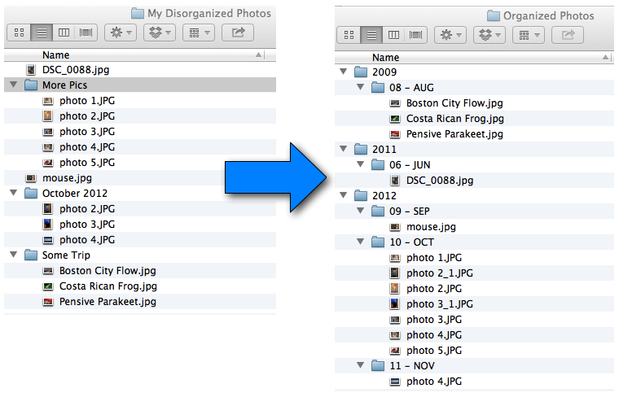

# SortPhotos

# Description

SortPhotos is a Python script that organizes photos into folders by date and/or time (year, year/month, year/month/day, or other custom formats).  If you're like me then your growing collection of files are contained in a bunch of folders, some with a date like "Sep 2010", and others with names like "Camping Trip".  SortPhotos takes this collection of folders and files and reorganizes them into a hierarchy of folders by almost any custom date/time format (by default it is by year then month).  It will work with any file, but works best with image and video files that contain EXIF or other metadata formats because that stays with the file even if the files are modified.  The script is also useful for transferring files from your camera into your collection of nicely organized photos.

# Install

    python setup.py install
 
 Note that in addition to python you must have perl installed as the underlying exif library depends on perl.

# Usage

SortPhotos is intended to be used primarily from the command line.  To see all the options, invoke help

    python sortphotos.py -h

The simplest usage is to specify a source directory (the directory where your mess of files is currently located) and a destination directory (where you want the files and directories to go).  By default the source directory is not searched recursively but that can be changed with a flag as discussed below.

    python sortphotos.py /Users/Me/MessyDirectory /Users/Me/Pictures

## copy rather than move
There are several options that can be invoked.  For example the default behavior is to move files from your source directory to your destination directory.  Note that it is  **much** faster to move the files rather than copy them (especially if videos are involved).  However, if you want to copy this is done with the ``-c`` or ``--copy`` flag.

    python sortphotos.py -c /source /destination

## search source directory recursively

By default, only the top level of the source directory is searched for files.  This is useful if you dump photos into your top directory and then want them to sort.  If you want to search recursively, use the ``-r`` or ``--recursive`` flag.

## silence progress updates

If you don't want to see details on file processing use the ``-s`` or ``--silent`` flag.  It will still show overall progress.

## test mode

If you just want to simulate what is going to happen with your command use the ``-t`` or ``--test`` flag.  No files will be moved or copied, but all the moves will be simulated showing you how the files would be reorganized/renamed.  

## sort in directories
By default folders are sorted by year then month, with both the month number and name.  So for example if cool_picture.jpg was taken on June 1, 2010 the resulting directory hierarchy will look like: 2010 > 06-Jun > cool_picture.jpg.  However, you can customize the sorting style almost anyway you want.  The script takes an optional argument ``-s`` or ``--sort``, which accepts a format string using the conventions described [here](https://docs.python.org/2/library/datetime.html#strftime-and-strptime-behavior).  To separate by subdirectory, just use a forward slash (even if you are on Windows).    So for example, the default sorting behavior (2010/06-Jun) is equivalent to:

    python sortphotos.py --sort %Y/%m-%b

 Or you could sort just by month, but with the month full name (June):

    python sortphotos.py --sort %B

Or you can sort by year without century, then week number, then an abbreviated day of the week (10/23/Sun)

    python sortphotos.py --sort %y/%W/%a

The possibilities go on and on.

## automatic renaming of files

You can setup the script to automatically rename your files according to the same convention.  This uses the same conventions for directory sorting and is described [here](https://docs.python.org/2/library/datetime.html#strftime-and-strptime-behavior).  For example you could rename all of your files to contain the year, month, day, hour, and minute by using

    python sortphotos.py --rename %Y_%m%d_%H%M

This would create files like: 2003_1031_1544.jpg.  By default the script keeps the original name and the original extension.  In all cases a unique digit in appended in the case of name collisions.  

## restrict which groups/tags to search through

sortphotos.py uses Exiftool.py to search through all metadata that has date information and uses the metadata with the oldest date (which may be more than one metadata tag).  For example, if "EXIF:CreateDate" is the tag with the oldest date it is automatically used.  There are several filters you can use to restrict which groups/tags to search through for the oldest date.  All the groups/tags are described [here](http://www.sno.phy.queensu.ca/~phil/exiftool/TagNames/) (with a few extra ones [here](http://www.sno.phy.queensu.ca/~phil/exiftool/TagNames/Extra.html)). One common usage is to ignore all file metadata which is not persistent (i.e., FileModifyDate, FileCreateDate, etc.).  This is accomplished with:

    python sortphotos.py source destination --ignore-groups File

This would search through all other groups (EXIF, JPG, etc.) looking for relevant date tags and keep the oldest, but would not use File timestamps.  If there is no metadata (except file timestamp data) then the file will just stay where it is.  You could also specify specific tags to ignore

    python sortphotos.py source destination --ignore-tags File:FileModifyDate File:FileCreateDate

Alternatively you could specify the complete set of groups that you want to use

    python sortphotos.py source destination --use-only-groups EXIF XMP IPTC

and this would only look for date tags in EXIF, XMP, IPTC.  Or you could restrict to a specific set of tags

    python sortphotos.py source destination --use-only-tags EXIF:CreateDate EXIF:DateTimeOriginal

<!-- ## selected what to sort by (defining the tags)

sortphotos.py takes a list of tags you want to search for.  This list should be ordered in terms of precedence.  The default list is

    python sortphotos.py source dest --tags CreationDate DateTimeOriginal DateTimeCreated CreateDate DateCreated FileCreateDate FileModifyDate

The first five are different EXIF data tags, and the last two are file stamp data.  This means if any of the EXIF data is available for a given file, the script will sort the file by that EXIF data, but if none of the options given are available it will fall back on file timestamp data.  If you want to only sort using EXIF data and have any files without EXIF data left behind for manual sorting, you could specify something like

    python sortphotos.py source dest --tags CreationDate DateTimeOriginal DateTimeCreated CreateDate DateCreated

These five are commonly used tags, but there are a wide range of EXIF and other tags available (listed [here](http://www.sno.phy.queensu.ca/~phil/exiftool/TagNames/index.html)).  For the specific file types you use, you should rearrange or add the corresponding EXIF tags you need.   -->

## duplicate removal
SortPhotos will *always* check to make sure something with the same file name doesn't already exist where it's trying to write, so that you don't unintentionally overwrite a file. It this occurs it will append a number on the end of the file.  So for example if photo.jpg was taken on June 1, 2010 but 2010 > June > photo.jpg already exists then the new file will be moved as photo_1.jpg and so on.  SortPhotos will go one step further and if it finds a file of the same name, it will then run a file compare to see if the files are actually the same.  If they are *exactly* the same, it will just skip the copy (or move) operation.  This will prevent you from having duplicate files.  However you have the option of turning this off (not the name comparison, that will always happen, just the weeding out of duplicates).  This option would be useful, for example, if you are copying over a bunch of new photos that you are sure don't already exist in your organized collection of photos.  Invoke the option ``--keep-duplicates`` in order to skip duplicate detection.

    python sortphotos.py --keep-duplicates /source /destination

<!-- ## choose which file types to search for
You can restrict what types of files SortPhotos looks for in your source directory.  By default it only looks for the most common photo and video containers ('jpg', 'jpeg', 'tiff', 'arw', 'avi', 'mov', 'mp4', 'mts').  You can change this behavior through the ``extensions`` argument.  Note that it is not case sensitive so if you specify 'jpg' as an extension it will search for both jpg and JPG files or even jPg files.  For example say you want to copy and sort only the *.gif and *.avi files you would call

    python sortphotos.py /source /destination --extensions gif avi

If you only want to sort the files that (potentially) have EXIF data then

    python sortphotos.py /source /destination --extensions jpg tiff

You may want to use this for files that aren't photos or videos at all

    python sortphotos.py /source /destination --extensions docx xlsx pptx

To sort every possible file type

    python sortphotos.py /source /destination --extensions *

However, this option will copy even hidden files like .DS_Store. -->

<!-- ## ignore EXIF
If you don't want to use EXIF data at all (even if it exists) and just use time stamps you can add the ``--ignore-exif`` flag.
 -->

## change time of day when the day "begins"
If you are taking photos for an event that goes past midnight, you might want the early morning photos to be grouped with those from the previous day.  By default the new day begins at midnight, but if you wanted any photos taken before 4AM to be grouped with the previous day you can use  
``--day-begins 4``  
The argument to the flag should be an integer between 0-23 corresponding to the hours of the day starting at midnight.

# Automation

*Note while sortphotos.py was written in a cross-platform way, the following instructions for automation are specific to OS X.  For other operating systems there are of course ways to schedule tasks or submit cron jobs, but I will leave that as an exercise for the reader.*

An an optional setup, I like to automate the process of moving my photos.  This can be accomplished simply on OS X using Launch Agents.  First edit the supplied plist file ``com.andrewning.sortphotos.plist`` in any text editor.  On line 10 enter the **full path** of where ``sortphotos.py`` is stored.  On line 12 enter the full path of your source directory (I use Dropbox to transfer photos from my phone to my computer).  One line 13 enter the full path of the destination top level directory (e.g., ``/Users/Me/Pictures``).  Finally, on line 16 you can change how often the script will run (in seconds).  I have it set to run once a day, but you can set it to whatever you like.

Now move the plist file to ``~/Library/LaunchAgents/``.  Switch to that directory and load it

    $ launchctl load com.andrewning.sortphotos.plist

That's it.  It will now run once a day automatically (or to whatever internal you picked).  Of course if there are no pictures in the source folder the script does nothing and will check again at the next interval.  There are ways to use folder listeners instead of a time-based execution, but this script is so lightweight the added complexity is unwarranted.  If you want to make sure your service is scheduled, execute

    $ launchctl list | grep sortphotos

and you should see the Agent listed (I grep the results because you will typically have many services running).  If you want to stop the script from running anymore just unload it.

    $ launchctl unload com.andrewning.sortphotos.plist

# Acknowledgments

SortPhotos grabs EXIF data from the photos/videos using the very excellent [ExifTool](http://www.sno.phy.queensu.ca/~phil/exiftool/) written by Phil Harvey.

# ChangeLog (of major changes)

### 7/17/2015

- @nueh fix for Python 2.5 (which you might be stuck with on a NAS for example).  
- bug fixes (ignore hidden files, ignore dates with only time but no date)

### 5/9/2015

- Windows compatibility fix (thanks PaulRobson)
- added setup script (thanks josephholsten)
- ignore GPS time stamps (thanks egallen for finding error)
- fix for non-ascii file names (thanks maxsl for finding error)

### 11/28/2014

Another complete rewrite.  The script retains the powerful metadata reading capabilities of ExifTool but now uses its own file processing as it did before for more flexibility.  Specifying what tags to look for required some guesswork, so this version automates this by looking through tags for the oldest date.  Restrictions can be set on what groups/tags to search across.  Some flags have changed.  Sees rest of README.

Main Changes

- better automatic tag searching.  Now automatically finds tags with date information and looks for the oldest.  Lots of options for what groups/tags to restrict search to
- duplicates can now be automatically removed (only if name is exactly the same and a file hash is exactly the same).
- ``--day-begins`` feature is added back in
- much more information is reported during processing

### 11/15/2014

The version is a complete overhaul of the past script.  It now makes use of the excellent ExifTool by Phil Harvey, which amongst other things gives us the ability to read EXIF or other metadata for a [wide range of file types](http://www.sno.phy.queensu.ca/~phil/exiftool/#supported).  Before we were limited primarily to jpg and a few other image types, but now most video formats are included as well as a wide range of RAW file types.  ExifTool also provides a lot of the file moving functionality that was previously contained in this tool so sortphotos.py is much simpler and has a few new capabilities.  There are a few features that were in sortphotos.py that have been left out  in this new version.  Because we are taking advantage of implementation features in ExifTool to handle the file management, we gained some capabilities but also lost some.  Missing features are detailed below and may be re-added in the future.  The usage of the script, while very similar to how it was before, is not perfectly backwards compatible.  If one of the critical features for you is missing then you shouldn't update at this time.  If you are using sortphotos.py in other automated scripts then you should update those to conform to the new usage.

Main changes

- EXIF data can be extracted for a huge number of file types, including videos
- automatic file renaming is supported
- the source directory can now be searched non-recursively, and that is in fact the default now
- by default the script moves rather than copies (behavior was reversed before)
- more descriptive information is given on where the files are going
- a test option allows you to simulate what will happen when you run the script without actually moving/copying any files

Previous features that were in sortphotos.py but have not yet been reincorporated into the new version

- Duplicates are not automatically removed.  Before if two files were exactly the same (through a hash) one would be removed.  The new version does not remove any files.  If two files have the same name it will not overwrite but will append a number at the end.
- the --day-begins feature is not included.  Before you could specify an hour that you wanted the day to start so you could group early morning photos with the previous day, but because of the way things are currently implemented this was not straightforward to add back in.

# License

Copyright (c) 2013, S. Andrew Ning.  All rights reserved.

All code is licensed under [The MIT License](http://opensource.org/licenses/mit-license.php).
